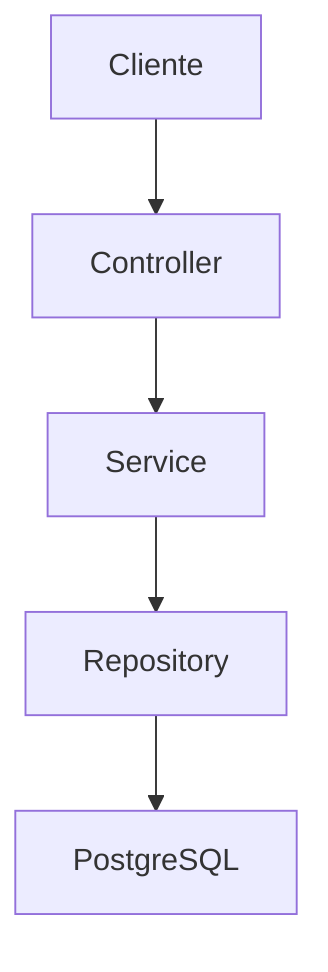
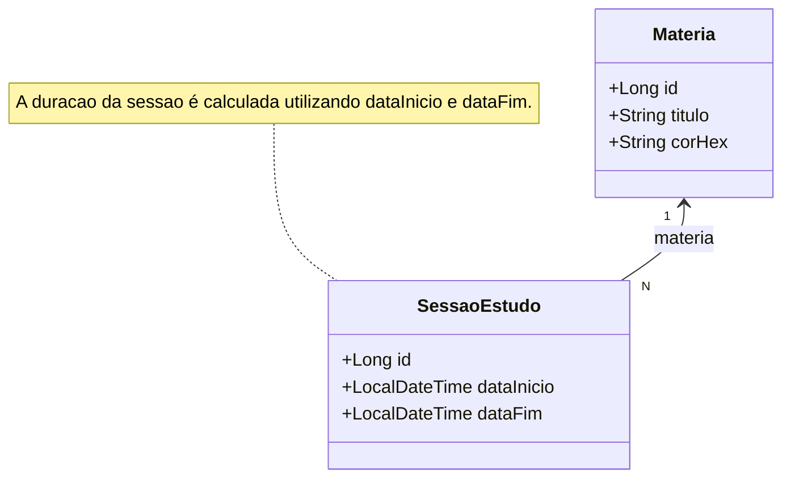
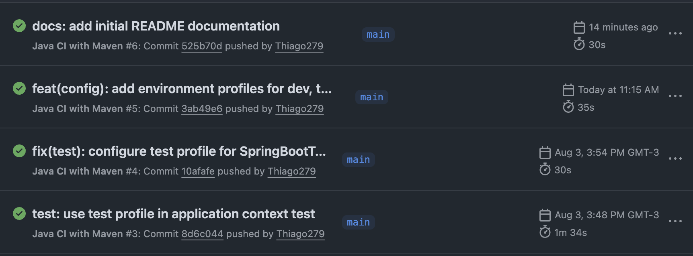
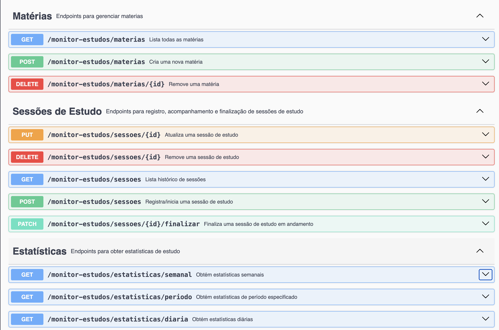

# Monitor Estudos

Backend REST desenvolvido com **Spring Boot** para gerenciamento de sessões de estudo, aplicando boas práticas de arquitetura, testes automatizados, versionamento de banco de dados e integração contínua.


# Sobre o projeto

O Monitor Estudos é uma API REST desenvolvida para gerenciar sessões de estudo e acompanhar estatísticas de aprendizagem. O projeto está sendo construído de forma incremental e tem como objetivo evoluir para uma aplicação completa, utilizada para acompanhar e organizar sessões de estudo reais.

Além das funcionalidades da aplicação, o desenvolvimento prioriza práticas adotadas em projetos profissionais, como arquitetura em camadas, separação de responsabilidades, validação de regras de negócio, testes automatizados, versionamento de banco de dados, conteinerização da aplicação e integração contínua.

Atualmente a API oferece gerenciamento de matérias, controle de sessões de estudo e geração de estatísticas, servindo como base para uma futura interface web desenvolvida em Angular.

##  Funcionalidades

-  Cadastro e gerenciamento de matérias de estudo.
-  Controle de sessões de estudo, permitindo iniciar e finalizar sessões.
-  Validação de conflitos entre sessões para impedir sobreposição de horários.
-  Consulta de estatísticas diárias de estudo.
-  Consulta de estatísticas por período personalizado.
-  Tratamento centralizado de exceções com respostas padronizadas.
-  Cobertura das principais regras de negócio por meio de testes automatizados.

## Arquitetura

O projeto segue uma arquitetura em camadas inspirada nas boas práticas do ecossistema Spring Boot.
Além disso, o projeto utiliza DTOs para comunicação com a API e um Global Exception Handler para padronização das respostas de erro.




## Modelo de Domínio



# Tecnologias

| Categoria       | Tecnologias                   |
| --------------- | ----------------------------- |
| Linguagem       | Java 21                       |
| Framework       | Spring Boot                   |
| Persistência    | Spring Data JPA               |
| Banco           | PostgreSQL                    |
| Migrações       | Flyway                        |
| Testes          | JUnit 5, Mockito, MockMvc, H2 |
| Conteinerização | Docker                        |
| Documentação    | Swagger / OpenAPI             |
| CI              | GitHub Actions                |
| Build           | Maven                         |


## Como executar

### Pré-requisitos

Antes de iniciar a aplicação, certifique-se de possuir os seguintes softwares instalados:

- Java 21
- Docker e Docker Compose
- Git

### 1. Clone o repositório

```bash
git clone https://github.com/Thiago279/monitor-estudos.git
cd monitor-estudos
```

### 2. Inicie o banco de dados

O projeto utiliza PostgreSQL executando em um container Docker.

```bash
docker compose up -d
```

> As tabelas do banco são criadas automaticamente através das migrações do Flyway durante a inicialização da aplicação.

### 3. Execute a aplicação

O projeto utiliza diferentes perfis do Spring Boot para cada ambiente.

Para executar a aplicação em ambiente de desenvolvimento:

```bash
./mvnw spring-boot:run -Dspring-boot.run.profiles=dev
```

Ou configure o profile `dev` na sua IDE antes de iniciar a aplicação.

### 4. Acesse a documentação da API

Após iniciar a aplicação, a documentação interativa estará disponível em:

```text
http://localhost:8080/swagger-ui/index.html
```

## 📂 Estrutura do Projeto

```text
src
├── main
│   ├── java
│   │   └── com.toma.monitor_estudos
│   │       ├── controller
│   │       ├── domain
│   │       ├── dto
│   │       │   ├── diaria
│   │       │   ├── periodo
│   │       │   └── semanal
│   │       ├── exception
│   │       ├── repository
│   │       ├── service
│   │       └── MonitorEstudosApplication.java
│   │
│   └── resources
│       ├── db
│       │   └── migration
│       ├── application.yml
│       ├── application-dev.yml
│       └── application-prod.yml
│
└── test
    ├── java
    │   └── com.toma.monitor_estudos
    │       ├── controller
    │       ├── exception
    │       ├── repository
    │       └── service
    │
    └── resources
        └── application-test.yml
```

### Organização das camadas

| Camada | Responsabilidade |
|---------|------------------|
| **Controller** | Expõe os endpoints REST e recebe as requisições HTTP. |
| **Service** | Implementa as regras de negócio da aplicação. |
| **Repository** | Responsável pelo acesso ao banco de dados através do Spring Data JPA. |
| **Domain** | Contém as entidades persistidas no banco de dados. |
| **DTO** | Modelos utilizados para comunicação entre a API e os clientes. |
| **Exception** | Tratamento centralizado de exceções e padronização das respostas de erro. |
| **db/migration** | Scripts SQL versionados utilizados pelo Flyway para criação e evolução do banco de dados. |


## Decisões Técnicas

Durante o desenvolvimento do projeto, algumas decisões foram tomadas com o objetivo de aproximar a aplicação de um ambiente de desenvolvimento profissional.

### Modelagem das sessões de estudo

As sessões armazenam `dataInicio` e `dataFim`, em vez de apenas a duração.

Essa abordagem permite:

- calcular a duração da sessão dinamicamente;
- identificar conflitos de horário;
- gerar estatísticas por dia, semana e período;
- manter sessões em andamento mesmo que a aplicação seja encerrada ou o computador seja desligado.

A duração é derivada dessas duas informações, evitando redundância e inconsistências.

### Arquitetura em Camadas

A aplicação foi organizada utilizando uma arquitetura em camadas (`Controller`, `Service` e `Repository`), promovendo separação de responsabilidades, maior facilidade de manutenção e melhor testabilidade.

### Versionamento do Banco de Dados

O banco de dados é controlado pelo **Flyway**, permitindo que toda alteração de esquema seja versionada por meio de scripts SQL.

Essa abordagem elimina a dependência do Hibernate para criação automática das tabelas e torna a estrutura do banco reproduzível em qualquer ambiente.

### Perfis de Execução

A aplicação utiliza perfis distintos do Spring Boot para separar os ambientes de desenvolvimento, testes e produção.

- **dev** → PostgreSQL em Docker para desenvolvimento local.
- **test** → Banco H2 em memória utilizado durante os testes automatizados.
- **prod** → Configuração baseada em variáveis de ambiente para deploy.

### Testes Automatizados

As principais regras de negócio são cobertas por testes unitários e testes de integração utilizando:

- JUnit 5
- Mockito
- MockMvc
- H2 Database

### Integração Contínua

O projeto utiliza **GitHub Actions** para executar automaticamente o pipeline de build a cada Push e Pull Request.

A esteira realiza:

- compilação do projeto;
- execução da suíte de testes;
- validação da integridade da aplicação antes da integração do código.

<p align="center">
  
  <br>
  <sub><i>Execuções recentes do pipeline de CI/CD com validação de testes.</i></sub>
</p>

## Documentação da API

A API possui documentação interativa gerada automaticamente utilizando **SpringDoc OpenAPI (Swagger)**.

Após iniciar a aplicação, a documentação pode ser acessada em:

```text
http://localhost:8080/swagger-ui/index.html
```

Ela permite visualizar todos os endpoints disponíveis, modelos de requisição e resposta, além de realizar testes diretamente pelo navegador.


<!-- Seção: Histórico de Execuções -->
<p align="center">
  
  <br>
  <sub><i>Endpoints interativos com Swagger.</i></sub>
</p>


## Roadmap

### Concluído

- [x] CRUD de matérias
- [x] CRUD de sessões de estudo
- [x] Validação de conflitos de horário
- [x] Estatísticas diárias
- [x] Estatísticas por período
- [x] Flyway
- [x] Testes automatizados
- [x] GitHub Actions

### Em desenvolvimento

- [ ] Frontend em Angular
- [ ] Integração Backend + Frontend
- [ ] Autenticação com Spring Security
- [ ] Gerenciamento de usuários
- [ ] Dashboard completo de estudos
- [ ] Deploy da aplicação


## Status

Status: Em desenvolvimento ativo

Versão atual: v0.4.0


## Autor

**Thiago Shihan Cardoso Toma**

Desenvolvedor Backend Java em formação na Universidade Presbiteriana Mackenzie, com foco em Spring Boot, APIs REST e boas práticas de engenharia de software.

## Licença

Este projeto está licenciado sob a licença MIT. Consulte o arquivo [LICENSE](LICENSE) para mais informações.


